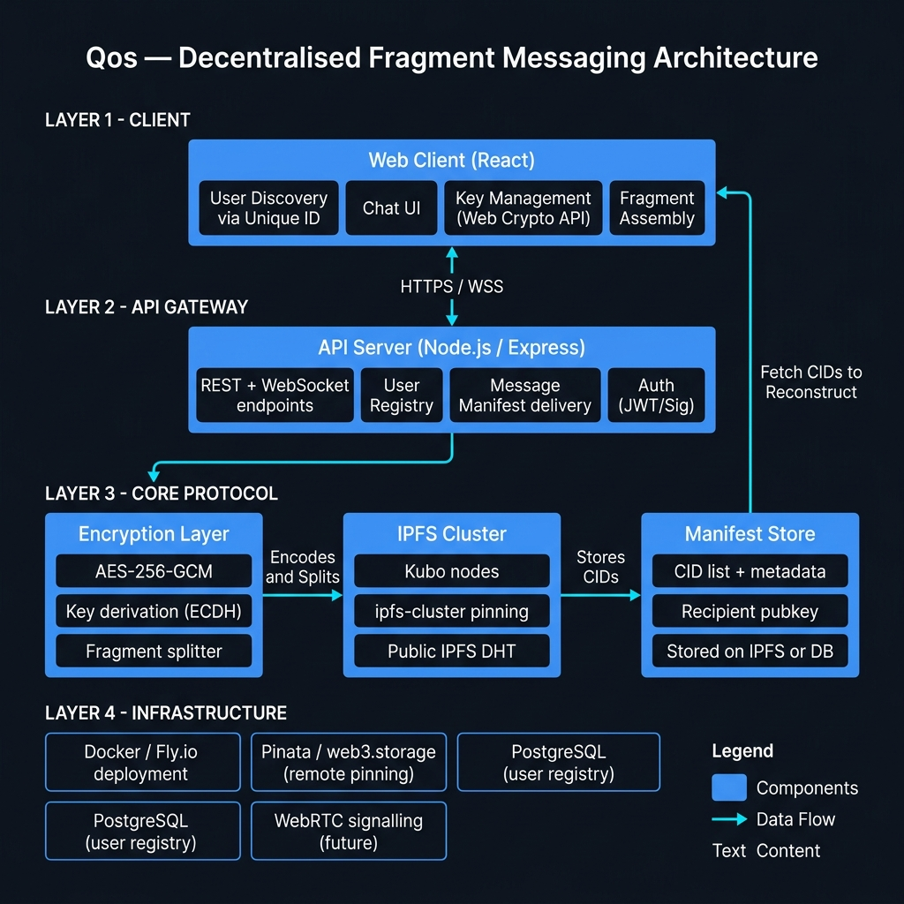

# Qos (Қос) — Full Development Plan

### For full transparency, this plan was developed with Claude Sonnet 4.6 (Thinking) !!!!!!!

> From current state → production-ready decentralised fragment messaging platform

---

## High-Level Architecture



---

## Current State Assessment

| Area | Status | Notes |
|---|---|---|
| `backend/utils/encryption.ts` | ✅ Done | AES-256-GCM encrypt, decrypt, fragment, reassemble |
| `backend/utils/ipfs.ts` | 🟡 Draft | Pins fragments to local IPFS Cluster only (localhost:9094) |
| `backend/utils/retrieval.ts` | 🟡 Draft | Fetches from local Kubo gateway (localhost:8080) |
| `backend/docker-compose.yml` | ✅ Done | Kubo + ipfs-cluster locally wired |
| `backend/test/integration/` | 🟡 Partial | encryption + ipfs tests exist, no retrieval tests |
| Key exchange / identity | ❌ Missing | No user identity, no public key infrastructure |
| Message manifest / CID index | ❌ Missing | No way to tell recipient where fragments live |
| API server | ❌ Missing | No HTTP/WebSocket server, no routes |
| User registry | ❌ Missing | No user accounts, no unique ID lookup |
| `web/` frontend | ❌ Missing | Folder does not exist yet |
| Remote IPFS pinning | ❌ Missing | Everything is localhost only |
| Deployment | ❌ Missing | No CI/CD, no cloud hosting |

---

## Architecture Overview

### The Messaging Flow (end-to-end)

```
Sender                          Network                         Recipient
  |                                |                                |
  |-- 1. Generate ephemeral AES key|                                |
  |-- 2. Encrypt message           |                                |
  |-- 3. Fragment ciphertext       |                                |
  |-- 4. Pin each fragment --------|-> Public IPFS DHT              |
  |-- 5. Collect CIDs              |                                |
  |-- 6. Build manifest            |                                |
  |    { cids[], aes_key_enc,      |                                |
  |      recipient_pubkey_id,      |                                |
  |      sender_id, timestamp }    |                                |
  |-- 7. POST manifest to API -----|-> API Server stores manifest   |
  |                                |         |                      |
  |                                |         |-- 8. Notify recipient|
  |                                |         |   (WebSocket / poll) |
  |                                |                                |
  |                                |    9. Recipient fetches        |
  |                                |       manifest <---------------|
  |                                |    10. Fetches CIDs from       |
  |                                |        IPFS <------------------|
  |                                |    11. Reassembles &           |
  |                                |        decrypts <--------------|
```

### Identity Model

Each user has:
- A **`@handle`** (e.g. `@alice`) — chosen by the user, globally unique, stored in PostgreSQL alongside an internal UUID. This format was chosen over the originally considered `qos:alice_7f3k` combined ID format, as it is more human-friendly and matches user expectations from modern messaging apps.
- An **ECDH keypair** (P-256) — private key stored locally in browser (IndexedDB, never leaves device), public key registered with the API server
- The AES session key per message is encrypted with the **recipient's public key** (ECIES / HKDF) before being embedded in the manifest

---

## Phase-by-Phase Plan

---

### Phase 1 — Backend: Complete the Core Library

**Goal**: Make the backend utilities production-ready and fully testable.

#### 1.1 — Refactor `ipfs.ts` for remote pinning
- Replace hardcoded `localhost` with environment-variable-driven config
- Add support for **Pinata** (primary and only pinning provider for now)
- Implement the pinning logic behind a `PinningStrategy` interface so a second provider can be plugged in later with minimal code changes
- Handle retry logic and error codes

> **Note**: A second pinning provider (e.g. web3.storage) as a fallback is a **low-priority future task**. The `PinningStrategy` abstraction ensures it can be added without a rewrite when the time comes.

#### 1.2 — Refactor `retrieval.ts` for public gateway
- Replace hardcoded gateway with configurable gateway list
- Add fallback logic: try `dweb.link`, `cloudflare-ipfs.com`, then local
- Add timeout and retry logic

#### 1.3 — Add key exchange layer (`backend/utils/keys.ts`)
- Implement ECDH P-256 keypair generation (using Node `crypto.generateKeyPairSync`)
- Implement ECIES-style AES key wrapping: encrypt the AES key with recipient's ECDH pubkey
- Export: `generateIdentityKeypair()`, `wrapKey(aesKey, recipientPubKey)`, `unwrapKey(wrapped, privateKey)`

#### 1.4 — Add manifest model (`backend/utils/manifest.ts`)

```typescript
// Shape of the "message envelope" stored server-side
interface MessageManifest {
  id: string;           // UUID
  sender_id: string;    // sender's internal UUID
  recipient_id: string; // recipient's internal UUID
  cids: string[];       // ordered fragment CIDs — order is the source of truth for reassembly
  wrapped_key: string;  // AES key encrypted with recipient pubkey (base64)
  timestamp: number;    // Unix ms — also used as the TTL anchor (expires 7 days after this)
  expires_at: number;   // timestamp + 7 days in Unix ms
  signature: string;    // canonical hash signature (see signing spec below)
}
```

**Signing spec** (canonical hash, not raw JSON.stringify):
```
sig_input = sender_id + recipient_id + String(timestamp) + cids.join(",") + wrapped_key
hash      = SHA-256(sig_input)
signature = ECDSA_sign(hash, sender_private_key)  // base64-encoded
```
This approach is deterministic regardless of JSON field ordering and covers the `cids[]` array order explicitly, making any tampering with CID sequence detectable.

- Export: `buildManifest(...)`, `verifyManifest(...)`

#### 1.5 — Complete the test suite
- Add integration tests for `retrieval.ts` (mock gateway responses)
- Add unit tests for `keys.ts` and `manifest.ts`
- Ensure all tests pass in CI

**Deliverable**: A fully tested, environment-configurable set of backend utilities — the "protocol library".

---

### Phase 2 — API Server

**Goal**: Build a lightweight Node.js/Express server that bridges users to the IPFS protocol layer.

#### 2.1 — Project bootstrap (`backend/server/`)
- `express` + `typescript` + `zod` (schema validation) + `ws` (WebSocket)
- Environment config via `dotenv`
- Separate from the utils library (but imports from it)

#### 2.2 — User Registry

**PostgreSQL** (via `drizzle-orm`) with the following schema:

```sql
-- users table
CREATE TABLE users (
  id           UUID PRIMARY KEY DEFAULT gen_random_uuid(),
  handle       TEXT NOT NULL UNIQUE,  -- @handle chosen by user, globally unique
  display_name TEXT NOT NULL,
  public_key   TEXT NOT NULL,         -- ECDH pubkey, JWK format
  created_at   TIMESTAMPTZ DEFAULT now()
);

-- manifests table
CREATE TABLE manifests (
  id           UUID PRIMARY KEY,
  sender_id    UUID REFERENCES users(id),
  recipient_id UUID REFERENCES users(id),
  payload      JSONB NOT NULL,        -- full manifest JSON
  delivered    BOOLEAN DEFAULT FALSE,
  created_at   TIMESTAMPTZ DEFAULT now(),
  expires_at   TIMESTAMPTZ NOT NULL   -- created_at + 7 days; a nightly cleanup job deletes expired rows
);

-- Index to make the nightly TTL cleanup efficient
CREATE INDEX idx_manifests_expires_at ON manifests (expires_at);
```

> **TTL policy**: All manifests expire **7 days after the message was sent** (`created_at + 7 days`). A nightly background job deletes expired rows and unpins the associated IPFS fragments from Pinata. Unread messages are permanently lost after expiry — this will be clearly communicated in the UI.

#### 2.3 — REST Endpoints

| Method | Route | Description |
|---|---|---|
| `POST` | `/auth/register` | Register: `{ handle, public_key }` → `{ id, token }` |
| `POST` | `/auth/challenge` | Issue a nonce for signature-based login |
| `POST` | `/auth/verify` | Verify signed challenge → returns JWT |
| `GET` | `/users/search?q=` | Search user by `@handle` or display name |
| `GET` | `/users/:id/pubkey` | Get a user's public key |
| `POST` | `/ipfs/pin` | Server-side fragment pinning via Pinata |
| `POST` | `/messages` | Submit a manifest |
| `GET` | `/messages/inbox` | Fetch pending manifests for authenticated user |
| `PATCH` | `/messages/:id/delivered` | Mark manifest as delivered |

#### 2.4 — WebSocket for real-time delivery
- On connect, authenticate via JWT
- Server pushes new manifest events: `{ type: 'new_message', manifest_id }`
- Client fetches full manifest from `GET /messages/inbox`

#### 2.5 — Auth: Signature-based (passwordless)
- Server sends a challenge nonce to the client
- Client signs it with their ECDH private key
- Server verifies against stored public key → issues JWT
- **No passwords ever stored**

**Deliverable**: A running, tested Express API server with user registry and manifest delivery.

---

### Phase 3 — Web Frontend (`web/`)

**Goal**: Build the React web app — the primary user-facing interface.

#### 3.1 — Project bootstrap

```
web/
├── src/
│   ├── api/          # typed fetch wrappers for all API routes
│   ├── components/   # reusable UI components
│   ├── hooks/        # useKeyStore, useMessages, useWebSocket
│   ├── pages/        # one file per route
│   ├── store/        # Zustand global state
│   └── styles/       # CSS custom properties + component styles
├── index.html
├── vite.config.ts
└── package.json
```

- Stack: `Vite` + `React` + `TypeScript`
- Router: `react-router-dom` v7
- Styling: **Vanilla CSS** (design tokens via CSS custom properties)
- State: `Zustand`

#### 3.2 — Key management in the browser
- On first launch: generate ECDH P-256 keypair via `window.crypto.subtle`
- Store private key in `IndexedDB` (never sent anywhere, ever)
- Register public key with the API server on account creation
- `useKeyStore` hook abstracts all crypto operations

#### 3.3 — Pages & Components

**Auth flow:**
- `/` — Landing page with tagline and "Get Started" CTA
- `/register` — Handle picker → generates keypair → `POST /auth/register`
- `/login` — Enter your `@handle` → signs challenge → gets JWT

**Main app (authenticated):**
- `/app` — Inbox: list of active conversations
- `/app/find` — **User Discovery**: search bar to find a user by their `@handle`
- `/app/chat/:userId` — Chat view with message composer

#### 3.4 — Send message flow (in-browser)

```
User types message
  → Generate AES key (Web Crypto API)
  → Encrypt message → ciphertext Uint8Array
  → Fragment ciphertext into chunks
  → POST each chunk to /ipfs/pin → returns CID per chunk
  → Wrap AES key with recipient's ECDH pubkey
  → POST manifest to /messages
  → UI shows "sent" ✓
```

#### 3.5 — Receive message flow

```
WebSocket fires: new_message event
  → GET /messages/inbox → get manifest
  → Fetch each CID from IPFS public gateway
  → Reassemble fragments
  → Unwrap AES key with own private key
  → Decrypt → plaintext string
  → Render in chat bubble
```

> **Note**: IPFS fragment fetching happens directly from the browser to public gateways (e.g. `cloudflare-ipfs.com`) — no need to proxy through the API server for retrieval.

**Deliverable**: Fully functional web app for user discovery and encrypted fragment messaging.

---

### Phase 4 — Shared Core Package (Monorepo Refactor)

**Goal**: Avoid duplicating crypto logic between `backend/` and `web/`.

#### 4.1 — Create `packages/core/`

```
packages/core/
├── src/
│   ├── encryption.ts    # browser-compatible (Web Crypto API, Uint8Array)
│   ├── fragmentation.ts # pure Uint8Array logic, shared by Node + browser
│   ├── manifest.ts      # TypeScript types + builders for MessageManifest
│   └── keys.ts          # ECDH key generation + AES key wrapping/unwrapping
├── package.json         # "name": "@qos/core"
└── tsconfig.json
```

#### 4.2 — npm workspaces

```json
{
  "name": "qos",
  "private": true,
  "workspaces": ["packages/*", "backend", "web"]
}
```

#### 4.3 — Both `backend/` and `web/` import `@qos/core`

**Deliverable**: Single source of truth for all protocol logic — no duplicated crypto code.

---

### Phase 5 — Remote Infrastructure & Deployment

**Goal**: Everything works on the public internet.

#### 5.1 — IPFS pinning via Pinata
- Fragment pinning goes through the **API server** (keeps API key server-side)
- `POST /ipfs/pin` on the API server calls `api.pinata.cloud/pinning/pinFileToIPFS`
- Retrieval uses public gateways directly from the browser
- Multi-pin strategy as a future low-priority upgrade (see Resolved Design Decisions)

#### 5.2 — Managed PostgreSQL
- **Neon** (serverless PostgreSQL, generous free tier) or **Supabase**
- Migrations tracked in `backend/migrations/` (plain SQL or drizzle-kit)

#### 5.3 — API server on Fly.io
- Add `Dockerfile` to `backend/server/`
- `fly.toml` with port 3000 config
- Secrets: `DATABASE_URL`, `PINATA_API_KEY`, `JWT_SECRET`
- GitHub Actions: on push to `main` → run tests → `fly deploy`

#### 5.4 — Web app on Vercel / Cloudflare Pages
- Connect GitHub repo → auto-deploy `web/` directory
- Env var: `VITE_API_URL=https://api.qos.fly.dev`
- HTTPS out of the box

#### 5.5 — Local dev Docker Compose update
- Add `postgres:16-alpine` service to existing `docker-compose.yml`
- Keep Kubo + cluster for local pinning during development

**Deliverable**: Live, publicly accessible Qos instance.

---

### Phase 6 — Security Hardening

**Goal**: Ensure the security model holds under scrutiny.

#### 6.1 — Threat model verification
- Even with ALL CIDs intercepted → no plaintext without AES key
- AES key only decryptable with recipient's private key (device-local)
- Manifest on server exposes only metadata — not content

#### 6.2 — Manifest signing
- Sender signs a canonical hash of manifest fields before posting (see Phase 1.4 signing spec)
- Recipient verifies signature on receipt → prevents server-side tampering

#### 6.3 — Key rotation support
- Allow users to rotate ECDH keypair
- New public key re-registered; new messages use new key
- Old private key retained locally for reading old messages

#### 6.4 — Rate limiting
- `/ipfs/pin`: max 100 fragments/min/user
- `/messages`: max 30 manifests/min/user
- JWT short-lived (15min) + refresh token rotation

#### 6.5 — Content size enforcement
- Max plaintext message: 10KB (~15 fragments)
- Future: larger limits for file attachments

**Deliverable**: Documented threat model + hardened API.

---

### Phase 7 — Polish & Future Features

#### 7.1 — UX polish
- Loading skeletons for IPFS fetch latency
- Delivery receipts ("✓✓" when manifest marked delivered)
- Optimistic UI (show message immediately, reconcile on confirmation)
- Graceful error states (fragment fetch failure, network timeout)

#### 7.2 — Group messaging
- Manifest carries multiple `wrapped_key` entries (one per recipient)
- No change needed to the fragmentation or IPFS layer

#### 7.3 — File attachments
- Fragment binary blobs the same way as text ciphertext
- Inline image rendering, download links for other types

#### 7.4 — Mobile (existing `mobile/` directory)
- Wire the React Native app to the same API once `@qos/core` is stable
- Share all crypto/protocol logic from the core package

---

## Milestone Summary

| # | Phase | Key Output | Complexity |
|---|---|---|---|
| 1 | Backend utils | Stable, tested protocol library | Low |
| 2 | API Server | User registry + manifest delivery + WebSocket | Medium |
| 3 | Web frontend | Full React app: auth, discovery, chat | High |
| 4 | Core package | `@qos/core` monorepo package | Low |
| 5 | Deployment | Live on Fly.io + Vercel, Pinata for IPFS | Medium |
| 6 | Security | Signing, rate limits, threat model | Medium |
| 7 | Polish | UX, groups, attachments, mobile | Ongoing |

---

## Recommended Build Order

```
Phase 1 → Phase 2 → Phase 4 → Phase 3 → Phase 5 → Phase 6 → Phase 7
(backend)  (API)    (core)    (web)    (deploy)  (security)  (future)
```

> **Important**: Do **Phase 4** (shared core package) before **Phase 3** (web app) to avoid writing the crypto logic twice.

---

## Key Design Decisions

| Decision | Rationale |
|---|---|
| AES-256-GCM | Authenticated encryption — confidentiality + integrity in one pass |
| ECDH P-256 | Supported natively in both Node.js `crypto` and browser Web Crypto API |
| Ordered `cids[]` array for fragment sequencing | Sufficient given the manifest is canonically signed — any reordering breaks the signature and is detected |
| 7-day manifest TTL | Bounds storage costs; nightly cleanup job unpins expired fragments from Pinata |
| `@handle` identity system | Chosen over `qos:alice_7f3k` combined ID format — human-friendly, matches user expectations |
| Pinata (single provider) for IPFS pinning | Production-grade, free tier for early scale. A second provider (low priority) will be added later via the `PinningStrategy` abstraction |
| Canonical hash signing for manifests | Deterministic; covers `cids[]` order explicitly; avoids `JSON.stringify()` ordering bugs |
| PostgreSQL for user registry | Strong consistency needed for identity; IPFS eventual consistency is unsuitable |
| Manifests server-side | IPFS has no push/notification model; server stores only metadata, not content |
| Private key in IndexedDB | Never leaves the browser — server has zero access to private keys |
| Fly.io for API | Docker-native, simple CLI, good free tier, global edge |
| Vite + React for web | Fast HMR, TypeScript-first, no SSR complexity needed |

---

## Resolved Design Decisions

All architectural questions have been answered. The table above captures the final decisions.

> **Future / low-priority backlog**: Adding a second IPFS pinning provider (e.g. web3.storage) as a fallback for fragment durability. The `PinningStrategy` abstraction in Phase 1.1 makes this a low-effort addition when the time comes.
